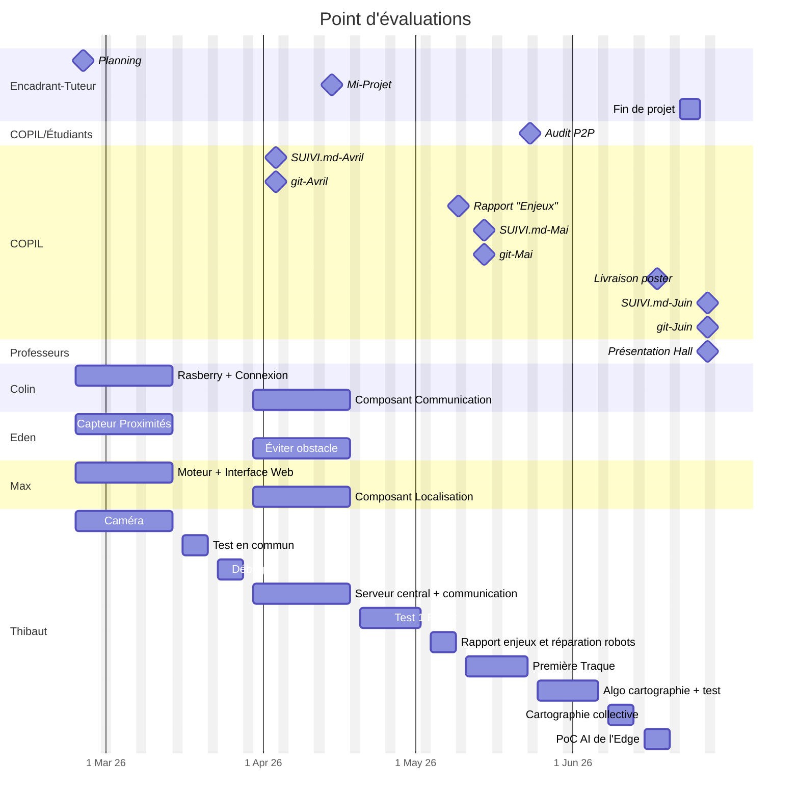

## Planning de l'équipe Artefact +++

Nous avons établi notre planning pour les deux périodes suivantes. Vous trouvez d'abord un tableau résumant les différentes actions groupées ou non, puis le complément en mermaid du planning global fourni.

<table>
    <thead>
        <tr>
            <th> ... </th>
            <th> Numéro de semaine </th>
            <th> Colin </th>
            <th> Eden </th>
            <th> Max </th>
            <th> Thibaut </th>
        </tr>
    </thead>
    <tbody>
        <tr>
            <td rowspan="3"> Test sur un seul robot </td>
            <td> Semaine 9,10,11 (vacances) </td>
            <td>2 semaines : mise en place de la raspberry + mise en place de la connexion</td>
            <td>2 semaines : Capteurs de proximité (comprendre comment ils marchent (Étude de l'art) + voir si on peut avoir une distance)</td>
            <td>2 semaines : moteurs (mise en place du programme déjà existant + test de précisions) + Interface Web </td>
            <td>2 semaines : CAMÉRA (flux video + faire bouger la caméra)</td>
        </tr>
        <tr>
            <td>Semaine 12</td>
            <td colspan="4" style="text-align : center;"> 1 Semaine de Tests en commun pour vérifier le bon fonctionnement des programmes développés. </td>
        </tr>
        <tr>
            <td>Semaine 13</td>
            <td colspan="4" style="text-align : center;"> 1 Semaine pour débuguer les problèmes détectés la semaine dernière. </td>
        </tr>
        <tr>
            <td rowspan="3"> Construction des algorithmes nécessaires à la traque </td>
            <td> Semaines 14,15,16 </td>
            <td> Modifier le composant de communication pour employer la 4G du réseau de Télécom Paris. </td>
            <td> Modifier le calcul de trajectoire pour contourner d’éventuels obstacles lors de la poursuite d’un robot cible. </td>
            <td> Modifier le composant de localisation du robot pour utiliser une position géographique au lieu des repères prédéfinis. </td>
            <td> Développer un algorithme qui sera utilisé pour décider du moment opportun de communiquer avec le serveur central de la traque. </td>
        </tr>
        <tr>
            <td> Semaines 17,18 </td>
            <td colspan="4" style="text-align:center;"> Test des algorithmes sur un seul robot. </td>
        </tr>
        <tr>
            <td> Semaine 19 </td>
            <td colspan="4" style="text-align:center;"> Semaine prévision de retard   +   Réparation des 2 autres robots.   +   Rédaction du rapport "enjeux"</td>
        </tr>
        <tr>
            <td> Utilisation de plusieurs robots </td>
            <td> Semaines 20,21 </td>
            <td colspan="4" style=text-align:center;> Tests :   Serveur central   Traque entre les Robots </td>
        </tr>
        <tr>
            <td rowspan="2"> Cartographie d'un champ 4G </td>
            <td> Semaines 22,23 </td>
            <td colspan="4" style="text-align:center;"> Développement de l'algorithme de cartographique.   +   Test de cartographie avec un robot</td>
        </tr>
        <tr>
            <td> Semaine 24 </td>
            <td colspan="4" style="text-align:center;"> Poster   +   Mise en place de la Stratégie de cartographie collective </td>
        </tr>
        <tr>
            <td> Bonus </td>
            <td> Semaine 25 </td>
            <td colspan="4" style="text-align:center;"> Mise en place de la PoC AI de l'Edge   <strong>OU</strong>   Résolution des beugs déjà existants </td>
        </tr>
    </tbody>
</table>

